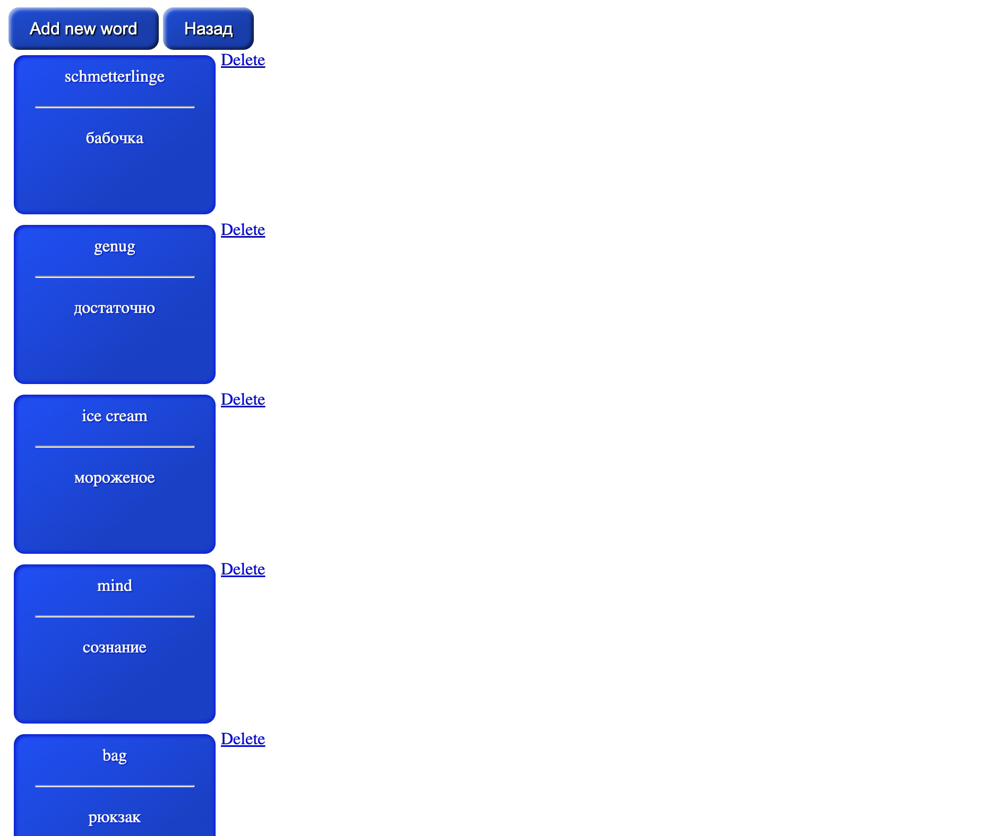

# FlashCards_A
FlashCards application позволяет пользователю сохранять карточки с термином и его определением. Это могут также быть и иностранные карточки. Пользователь
сначала регистрируется и после авторизации заходит в личный кабинет. Каждый авторизованный пользователь может
создавать подписанные папки с карточками и удалять данные папки. 

Были использованы следующие технологии: Spring Boot, Spring Security, Hibernate, Spring MVC. Оформление: html, css.

### 1) Пользователь сначала регистрируется, если у него нет аккаунта:

Данные пользователя сохраняются в базу данных.

 
### 2) Если пользователь зарегистрирован:

### 3) Личный кабинет пользователя с добавленными им папками. Он также может добавить новую папку.

### 4) Форма для добавления новой папки. Добавленные так же, как и слова, сохраняют в базу данных.

### 5) При открытии папки пользователю показываются слова в данной папке, которые были сохранены до этого им. Он также может добавить новое слово в данную папку.

### 6) Форма для добавления нового слова:

